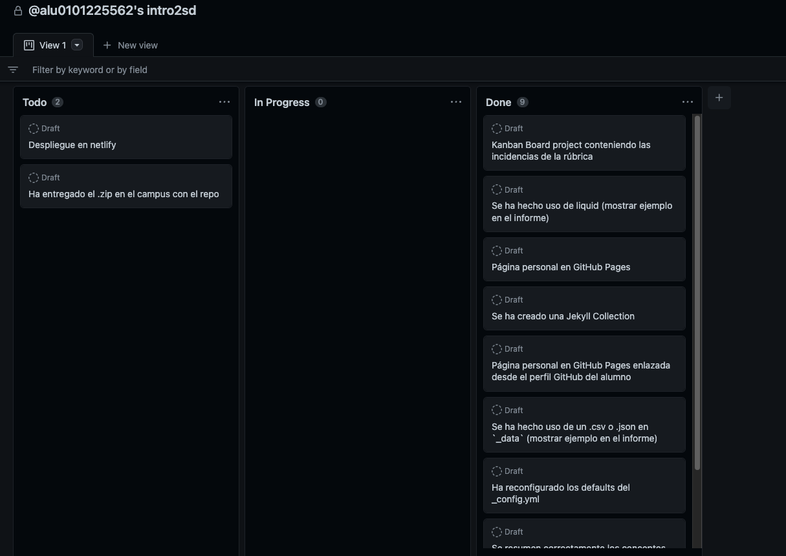
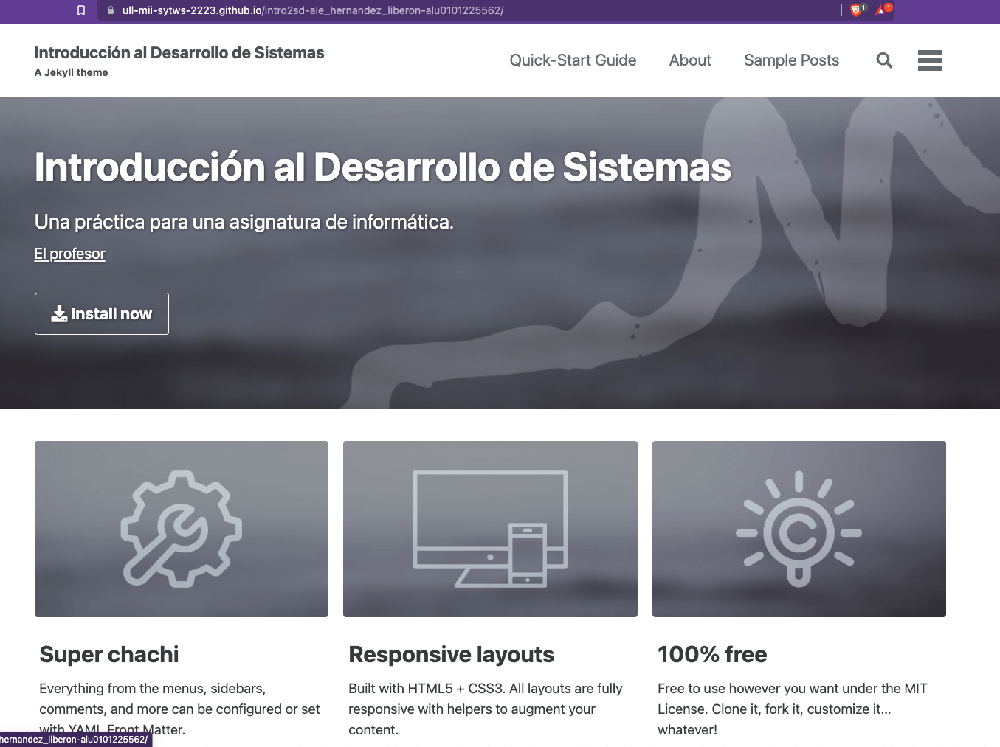
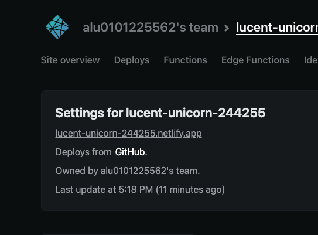
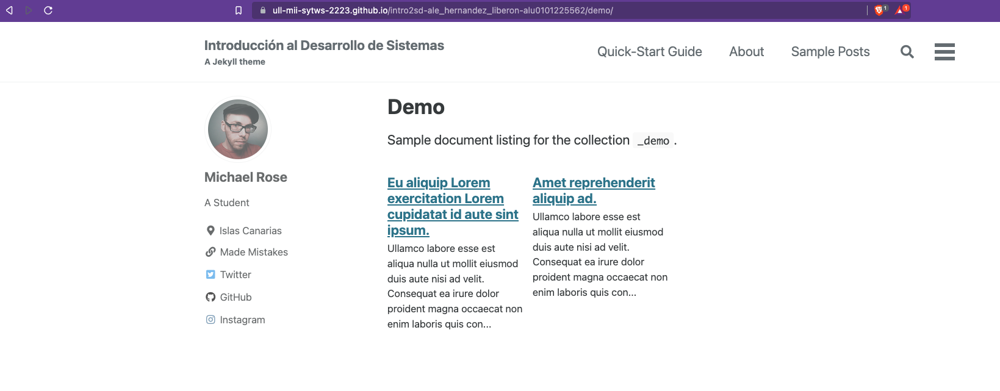
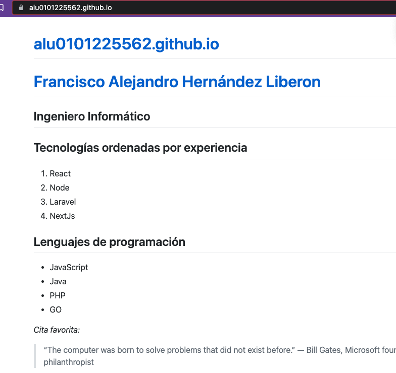
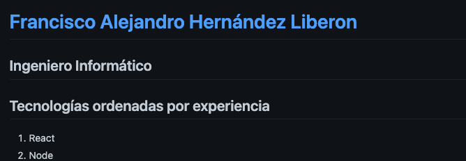

# Práctica intro2sd
Enlace netlify: https://lucent-unicorn-244255.netlify.app/
Enalce github pages: https://ull-mii-sytws-2223.github.io/intro2sd-ale_hernandez_liberon-alu0101225562/
Enlace pagina personal: https://alu0101225562.github.io/

## Kanban Project creado



## Reconfiguración de _config.yml
```yml
baseurl: "/intro2sd-ale_hernandez_liberon-alu0101225562/" # the subpath of your site, e.g. "/blog"

demo:
    output: true
    permalink: /:collection/:path/

# demo
  - scope:
      path: ""
      type: demo
    values:
      layout: single
      author_profile: false
      share: true
```
## Uso de liquid

```html
<ul>

  <li>
    <h3>{{ discipline.title }}</h3>
    <p>{{ discipline.content }}</p>
  </li>

</ul>
```

## Uso de _data
```js
    //_data/disciplinmes.json
[
    {
        "title": "Project management",
        "content": "If a systems development project is to be successful, technical expertise is not enough; effective project management is also required. The project manager plans the undertaking, mobilises the resources required and controls and coordinates the work"
    },
    {
        "title": "Business analysis",
        "content": "Business analysis is concerned with investigating the business situation and finding out what are the problems to be solvedor opportunities to be exploited."
    },
    {
        "title": "Project management",
        "content": "If a systems development project is to be successful, technical expertise is not enough; effective project management is also required. The project manager plans the undertaking, mobilises the resources required and controls and coordinates the work"
    },
```
## Despliegue en github pages


## Despliegue en netlify



## Collection de prueba



```yml
demo:
    output: true
    permalink: /:collection/:path/

# demo
  - scope:
      path: ""
      type: demo
    values:
      layout: single
      author_profile: false
      share: true
```

## Pagina personal github pages



## Enlace a la pagina personal en el perfil de github de el alumnp



